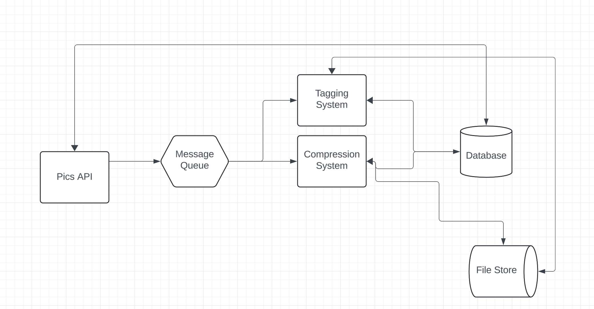

# REST API
Built with node.js + express

## Env variables
env variables stored in .env file

## Running the API
`npm run dev`

Starts on port `localhost:3000`

### Current System

In the above image this API is labeled as Pics API (although this api handles more than just the pictures)

### Future Improvements to the System / Scalability of the System

Future improvements are highligthed in green

## Devops
Currently nodemon isn't configured to watch and reload files